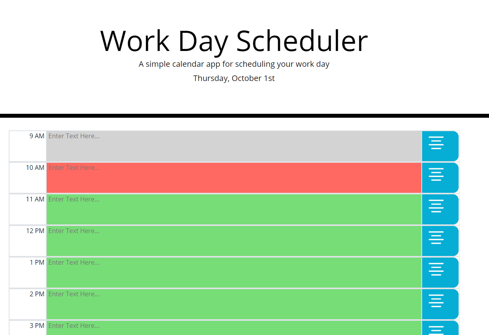

# FSB-DayPlanner
JQuery/Moment.JS Powered Day Planner

## Purpose:
The purpose of this program is to create a Work Day Planner to store tasks to do and follows the criteria below:
<ul>
<li>Color coding based on current hour compared to listed hour
<li>Ability to type text into fields and save it into local storage
<li>Refreshing page reloads previously saved tasks
</ul>

## Language Used:
Primarily JQuery with the Moment.js library

### Psuedo Example:
When presented with the planning page I can see the hours (9AM - 5PM) displayed.
Each hour has a corresponding text field color coded based on
<ul>
<li>Hour passed: Gray
<li>Current Hour: Red
<li>Future Hour: Green
</ul>
Each hour has a corresponding save button which will save all tasks written into local storage
When I refresh the page my tasks are still displayed

#### Example Image

#### Deployed Site
<a href="https://grimmedev.github.io/FSB-DayPlanner/">JavaScript Quiz</a>